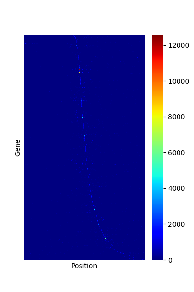
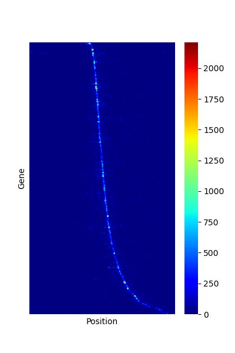

# `figure-generation`

Handy links:
- Check Matplotlib colors when building your config files: https://matplotlib.org/stable/gallery/color/named_colors.html


## `sankey_nt-transitions_FASTA.py`

```sh
usage: sankey_nt-transitions_FASTA.py [-h] [-o OUTPUT] [--range START END] [--width WIDTH] [--height HEIGHT] fasta

Sankey plot of nucleotide transitions

positional arguments:
  fasta                Input FASTA file

options:
  -h, --help           show this help message and exit
  -o, --output OUTPUT  Output HTML file
  --range START END
  --width WIDTH
  --height HEIGHT
```

Example:

```sh
python sankey_nt-transitions_FASTA.py test/ctcf_20bp.fa.gz -o ctcf.html
```

## `heatmap_CDT.py`

Make jet-style heatmap (or you can select another cmap from matplotlib).

```sh
usage: heatmap_CDT.py [-h] [-i cdt_fn] [-o output_svg] [--smooth SMOOTH] [--height HEIGHT] [--width WIDTH] [--cmap CMAP]

python heatmap_CDT.py -i INPUT.cdt -o OUTPUT.png

options:
  -h, --help            show this help message and exit
  -i cdt_fn, --input cdt_fn
                        CDT-formatted matrix for plotting heatmap (sub for ScriptManager heatmap)
  -o output_svg, --output output_svg
                        name of SVG filepath to save figure to (if none provided, figure pops up in new window)
  --smooth SMOOTH       Apply a gaussian smoothing filter by specifying sigma integer value (default no smoothing)
  --height HEIGHT       Height of heatmap image
  --width WIDTH         Width of heatmap image
  --cmap CMAP           Colormap choice (see matplotlib), default='jet'
```


Examples:

```
python heatmap_CDT.py -i test/test.cdt -o test/test_jet.png
python heatmap_CDT.py -i test/test.cdt -o test/test_jet_smooth1.png --smooth 1
```

